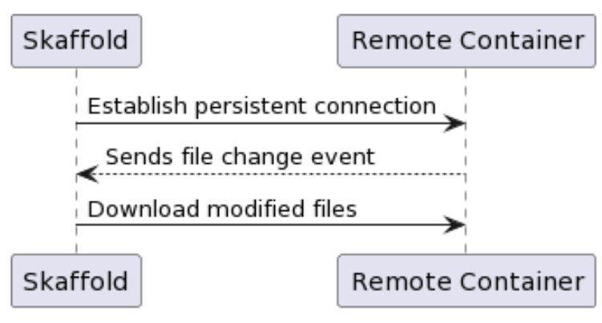
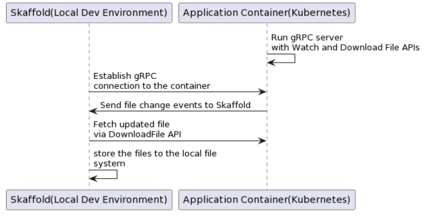
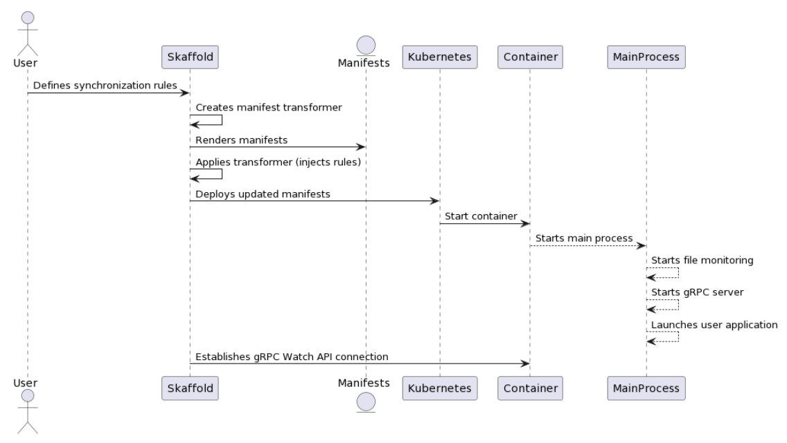
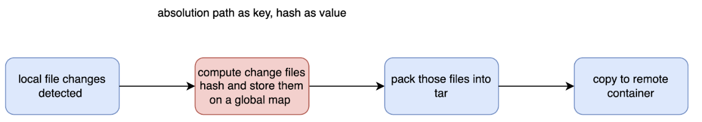
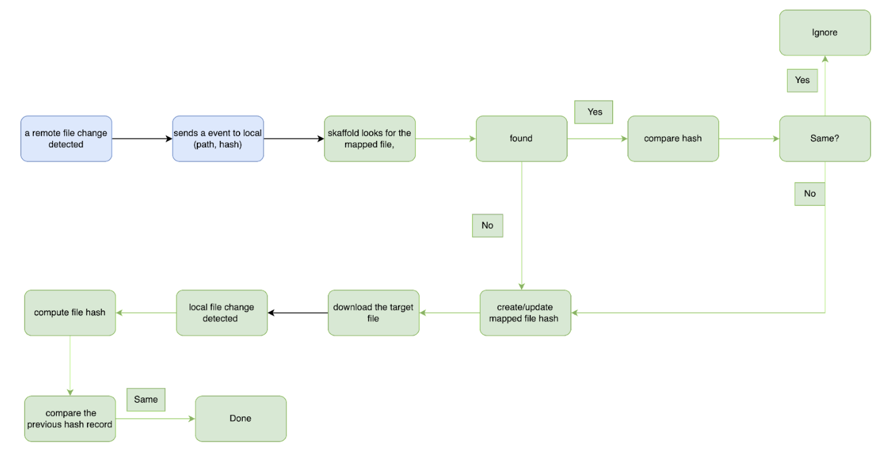

# Downstream Sync

## Objective
Enable Skaffold users to synchronize their files in kubernetes containers to their local filesystem during a skaffold dev session. 

## Proof of Concept:
 - https://github.com/ericzzzzzzz/skaffold/tree/downstream-sync 

## Summary

This design document introduces the concept of Downstream Sync for Skaffold. This feature targets the limitation of existing file synchronization being unidirectional – from the local development environment to the container. Downstream Sync allows for seamless synchronization of files generated or modified within a running container back to the developer's local machine.

Key components include a gRPC server embedded in the container, active file monitoring,  and a Kubernetes manifest transformer that initiates the entire process during container startup. Users will have control over which files to synchronize through defined rules.


## Background

The existing skaffold [file-sync](https://skaffold.dev/docs/filesync/) feature provides a way to quickly update running containers in kubernetes cluster without a full image rebuild and redeployment by monitoring file changes in the local development environment and then uploading them to the corresponding containers. However, the file sync is unidirectional–changes within the local development environment are pushed to the Kubenetes container, not vice versa. Applications that generate configuration files, logs, or other data within the container create a hurdle. Getting those changes back to the local environment for use in Git, analysis, or modification becomes cumbersome.


## Use case

 - **Complex App Configuration**: Developers needing to extract a large number of JSON configuration files modified by a containerized application for version control.
 - **Scaffolding & Generated Files**: Applications using code generators or scaffolders (e.g., Ruby on Rails) produce new files within the container that need to be reflected in the local project structure.
 - **Logging and Data Outputs**: The need to pull logs or data files generated by the containerized application back to the local environment for analysis


## Current workarounds && Challenges 
 - **Manual Extraction (kubectl cp)**: This is low-tech, error-prone, and requires knowledge of dynamic pod names.
 - **Volume Mounts (minikube)**: Can be complex, aren't environment-agnostic, and might trigger sync loops and race conditions with Skaffold.


## Design ideas

### Overview
 - **File Change Monitoring**:  A process running inside the application container actively monitors for file modifications.
 - **Persistent Connection**: A connection with Skaffold before any file changes occur.
 - **Skaffold Response**: Upon detecting changes, the process immediately transmits file change events over the pre-established connection. Skaffold then downloads the modified files and updates the corresponding files in the local development environment.




### Key Components Design

Implement a gRPC server within the application container to facilitate downstream file synchronization with Skaffold. This server would offer:
 - **Persistent Connection with Watch API**: A server-side streaming API (Watch) establishes a long-lived connection to Skaffold. This connection allows for real-time transmission of file change events (FileEvent) from the container as they occur.
 - **File Download API**: A separate server-side streaming API (DownloadFile) enables Skaffold to download the contents of modified files on demand by providing the file path.

**Grpc protos**:

```protobuf
syntax = "proto3";
package proto.filedownload;
option go_package = "github.com/GoogleContainerTools/skaffold/proto/filedownload";


service FileService {
 rpc DownloadFile (DownloadRequest) returns (stream DownloadResponse) {}
 rpc Watch(FileWatchRequest) returns (stream FileEvent) {}
}

message DownloadRequest {
 string path = 1;
}

message DownloadResponse {
 bytes chunk = 1;
}


message FileEvent {
 string path = 1;
 enum EventType {
   CREATE = 0;
   MODIFY = 1;
   DELETE = 2;
   RENAME = 3;
 }
 EventType event_type = 2;
 int64 version = 3;
 string MD5Hash = 4;
}


message FileWatchRequest {
}

```


Skaffold would interact with this setup as follows:

 - **Connection Establishment**: Upon detecting the container, Skaffold initiates a connection to the gRPC server's Watch endpoint.
 - **Event Monitoring**: Skaffold continuously listens for FileEvent messages from the container, indicating file creation, modification, deletion, or renaming.
 - **File Retrieval**: When Skaffold receives an event signifying a file change, it uses the DownloadFile API to fetch the updated contents of the file.
 - **Local Updates**: Skaffold seamlessly writes the downloaded file data into the corresponding location within the  local development environment.



The user defines rules for downstream file synchronization. Skaffold incorporates these rules into a Kubernetes manifest transformer. During the build and deployment process, Skaffold applies this transformer to the manifests.
Upon container startup, a process monitors file changes (based on the injected rules), starts a gRPC server, and launches the user's application as a subprocess. Skaffold then connects to the gRPC server's Watch API, enabling downstream file synchronization.



## implementation

To implement this solution,  we need a way to manage the user application and the monitoring/syncing logic as separate entities within the container.
We will embed a process (file monitoring + gRPC server) directly into the container image, making it part of the default container startup by rewriting the kubernetes resources manifests provided by the user before deploying them to the cluster. 


**Main Process**:
 - **File Monitoring**: Implements file system monitoring  to detect changes within designated directories.
 - **gRPC Server Setup**: Initializes the gRPC server with the Watch and DownloadFile services you defined.
 - **Client Communication** : Manages the persistent connection to Skaffold, transmitting file change events and serving download requests.
**User Application as Subprocess**f:
The main process launches the user application as a subprocess, allowing it to run concurrently. The user application operates independently, focused on its core functionality.

**Manifests rewriting example**:

Image Configuration : 

```json
{
   "Hostname":"",
   "Domainname":"",
   "User":"node",
   "AttachStdin":false,
   "AttachStdout":false,
   "AttachStderr":false,
   "ExposedPorts":{
      "3000/tcp":{
         
      }
   },
   "Tty":false,
   "OpenStdin":false,
   "StdinOnce":false,
   "Env":[
      "PATH=/usr/local/sbin:/usr/local/bin:/usr/sbin:/usr/bin:/sbin:/bin",
      "NODE_VERSION=14.9.0",
      "YARN_VERSION=1.22.5",
      "NODE_ENV=development"
   ],
   "Cmd":[
      "/bin/sh",
      "-c",
      "npm run $NODE_ENV"
   ],
   "Image":"sha256:de685340ddbbc28ca0b59f74023b808306e84af53e93a1612dfd0f14e9c45953",
   "Volumes":null,
   "WorkingDir":"/home/node/app",
   "Entrypoint":[
      "docker-entrypoint.sh"
   ],
   "OnBuild":null,
   "Labels":null
}
```


Manifest Before Rewriting: 
```yaml
Containers:
    Container ID:   docker://2291a48468762b3047fb5a80907b74857815bbd899e24a9be845ab4b7dd0a712
    Image:          node-example:9233d8bc84f8ea4aac9a5ddcf5a37e2eb2aa35b8a2a981019f9947ed23668cb6
    Image ID:       docker://sha256:9233d8bc84f8ea4aac9a5ddcf5a37e2eb2aa35b8a2a981019f9947ed23668cb6
    Port:           3000/TCP
    Host Port:      0/TCP
    State:          Running
    Started:        Tue, 30 Jan 2024 22:25:02 -0500
    Ready:          True
    Restart Count:  0
    Environment:    <none>
    Mounts:
     ...
```

Manifest After Rewriting:

```yaml
Containers:
    Container ID:  docker://53de8732b61a370a01961d87e87c5031b8e5527c23af42c42cfc9c535422f008
    Image:         node-example:9233d8bc84f8ea4aac9a5ddcf5a37e2eb2aa35b8a2a981019f9947ed23668cb6
    Image ID:      docker://sha256:9233d8bc84f8ea4aac9a5ddcf5a37e2eb2aa35b8a2a981019f9947ed23668cb6
    Port:          3000/TCP
    Host Port:     0/TCP
    Command:
      /sync-helper/app-server
    Args:
      --command
      docker-entrypoint.sh,/bin/sh,-c,npm run $NODE_ENV
      --targets
      src,abc
      --excludes
      node_modules/*,abc/bb.js
    State:          Running
    Started:      Tue, 30 Jan 2024 22:27:51 -0500
    Ready:          True
    Restart Count:  0
    Environment:    <none>
    Mounts:
      /sync-helper from mount-name (rw)
  ...
```
This rewrites container start command and arguments,  /sync-helper/app-server will be used when container starts and
the following arguments are added where 
 - `--targets` is a list of directories to be watched on the remote container
 - `--excludes` is the rules to exclude files, their change events will not be sent to local development
 - `--command`  is the original container startup command 

These values are from the new stanza(download) under build.artifacts.image we will add to skaffold.yaml

```yaml
apiVersion: skaffold/v4beta9
kind: Config
build:
 artifacts:
 - image: node-example
   context: node
   docker:
     buildArgs:
       ENV: development
   sync:
     manual:
     - src: 'src/**/*.js'
       dest: .
   download:
     manual:
       - remoteSrc: "src"
         localDst: "node/src"
       - remoteSrc: "abc"
         localDst: "node/abc"
     excludes:
       - "node_modules/*"
       - "abc/bb.js"
```

**Command: /sync-helper/app-server**
This is the binary used to setup file monitoring, grpc server  and starting the original command as a subprocess. Here is the image that builds it.

```dockerfile
FROM golang:1.21 AS builder


ARG CGO_ENABLED=0
ENV GO111MODULE=on


WORKDIR /app


COPY . .


RUN go build -o app-server server/main.go
RUN go build -o app-connect connect/main.go


FROM alpine:3
COPY --from=builder /app/app-server /app/app-connect .


CMD ["cp", "app-server", "app-connect", "/sync-helper"]
```

To streamline communication, we're introducing 'app-connect' to bridge Skaffold and the gRPC server. The server will use a Unix socket, and 'app-connect' will manage data transfer to the local environment. This simplifies the setup by removing the complexities of port mapping and collisions on both ends.


### Upstream File Synchronization workflow

The current Skaffold's file sync watches the local file changes and then creates a compressed tar file containing only the modified files matching user defined  sync rules. This tar file is transferred to the appropriate container in the remote application container and extracted, overwriting the old versions within the container. However, to integrate with downstream sync, we need to introduce additional steps on the upstream file synchronization flow. 



The red rectangle we need to introduce for this flow to avoid a potential infinite loop. 

### Downstream File synchronization Workflow


 - Blue rectangle represents the things happen on the remote container,
 - Green rectangle represents the things happen on the local development environment


### Limitations: 
 - Delete not supported
 - We’re fetching the whole content of a file from remote to local, not delta
Huge data transmission for Large files files being written frequently, like in memory db file or logs
These can be solved by implementing a rsync, considering the complexity and the actual use cases,  this should not be implemented right now

### Engineer Effort Estimation
 - TBD


## Open Discussions:

 - Why Skaffold need to check hash when getting events from the remote container
    - The current skaffold does upstream syncing by creating tar locally and upload to the application container and extract the tar there, this will trigger file change events as well on the remote container and the grpc server will send those events to local as well, because at the moment there is no way to tell if a file change event is triggered by changes directly made on the remote container or received from local environment. Skaffold will have to handle this situation locally. Skaffold has to store changed files hashes locally before it uploads them to remote and it has to check hash for target files on the events to decide if those files are ones it just uploaded to the remote to avoid an infinite loop.  It is also necessary for skaffold to update file hash records before it downloads from the remote container, as the downloading will trigger file event changes as well, we don’t want to upload them to the container again.
 - Can users specify an absolute path for remoteSrc?
 - Should remoteSrc be relative to workspace or build context ?
 - infer, manual for setting up directory mappings?
 - onComplete, inTime, for syncing files?
 - Also use grpc for upstream sync?
    - Pros:
       - the remote container will be able to distinguish file changes made on the container or upload from the local environment.
    -  Cons:
       - Huge engineer effort and risky Even if we want to have this, it should be a future work.
 - Remote image support?
    - The workaround for it is to wrap it in another image then use Skaffold to build it. 


## Alternatives considered

No Grpc server, but the user application is still started from another process. This process actively monitors for file changes and writes information about these changes (like file paths and event types) to a designated file. Skaffold will then remotely execute tail -f on this file within the container to continuously check for new entries. When Skaffold detects file changes, it remotely executes tar zf - [files] to compress the modified files and pipes it to local. It receives this compressed data and uses Golang's tar package to extract and update the corresponding files in your local development environment. This is easier to implement, but it’s not very extensible. 


